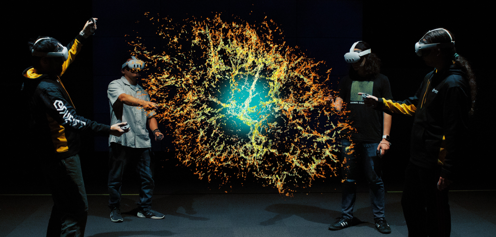
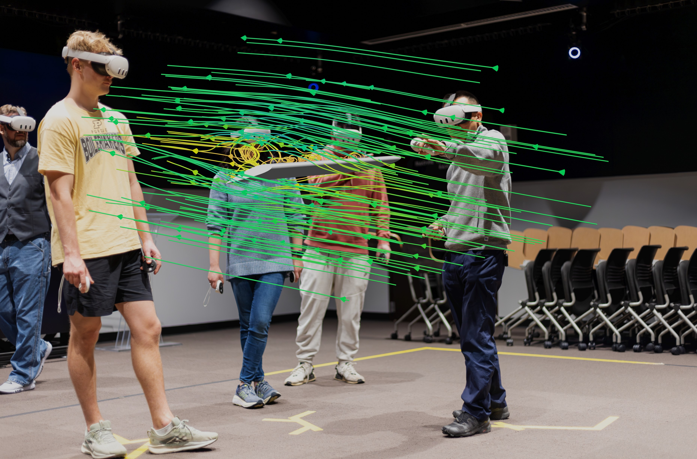

#  CollabXR

**CollabXR** is a shared immersive platform designed for collaborative learning, training, and research using interactive 3D content.

**[Documentation](https://envision-center.github.io/CollabXR-Documentation/) | [Website](https://envision.center/collabxr) | [Discord](https://discord.gg/MBwgJJwNmN) | [Collaborate With Us](https://purdue.ca1.qualtrics.com/jfe/form/SV_2b0p3gqYpaiVLGS)**

## Modding

You can create content for use inside CollabXR by creating [mods](https://envision-center.github.io/CollabXR-Documentation/modding.html).
To get started with making content for use inside CollabXR, see the [preparing for mod creation](https://envision-center.github.io/CollabXR-Documentation/modding/setup.html) and [making a mod tutorials](https://envision-center.github.io/CollabXR-Documentation/modding/prefab.html).

- See the docs for [hosting your own mod repository](https://envision-center.github.io/CollabXR-Documentation/modpackager/modrepository.html).
- See the [CollabXR ModExtras documentation](https://envision-center.github.io/CollabXR-Documentation/modextras.html) for additional modding tools.

## Contributing

If you would like to contribute to CollabXR directly, see the [Contributing guidelines](https://envision-center.github.io/CollabXR-Documentation/contribution.html).

